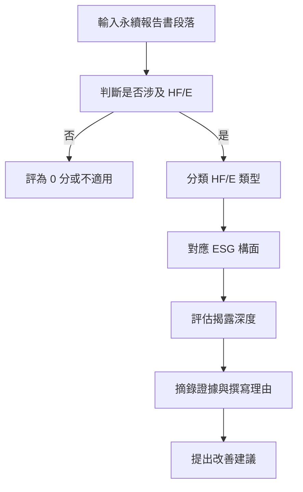

# HF/E ESG Report Analysis

本專案用於分析企業永續報告書、ESG 報告與 GRI 揭露內容中，是否出現與人因工程 Human Factors/Ergonomics, HF/E 相關的揭露，並進一步對應 ESG 構面與揭露深度評分。

專案包含一份可供 Codex 使用的 `SKILL.md`、分析範本、範例資料、編碼指引，以及一個規則式分析腳本，可作為研究、初步篩選或報告內容整理的輔助工具。

## 適用對象

- 永續報告書或 ESG 報告研究者
- ESG 分析人員
- 職業安全衛生與人因工程研究者
- 企業永續、EHS 或人資團隊
- 需要將報告段落整理為結構化分析表的人員

## 可分析內容

本專案適合處理下列類型的文字：

- 企業永續報告書段落
- ESG 或 GRI 揭露內容
- 職業安全衛生描述
- 員工教育訓練與福祉內容
- 工作環境與作業流程改善
- 製程改善、自動化或設備操作內容
- 能源效率、資源使用、減廢或環境績效描述
- 安全、效率、錯誤率、重工率或員工參與改善提案

## 分析目標

每一段文字會被整理為下列分析結果：

- 是否涉及 HF/E
- HF/E 分類：物理人因、認知人因、組織人因
- ESG 對應構面：社會構面、環境構面、社會－環境連結
- 揭露深度分數：0 至 3 分
- 證據摘錄
- 判斷理由
- 信心程度
- 改善建議

## 分析流程



## 專案結構

```text
HF-E-ESG-report-analysis/
├── README.md
├── SKILL.md
├── LICENSE
├── CITATION.cff
├── hfe_esg_analyzer.py
├── docs/
│   ├── category_definitions.md
│   ├── coding_guideline.md
│   └── scoring_rules.md
├── examples/
│   ├── input_paragraphs.md
│   ├── output_examples.md
│   └── sample_analysis_table.csv
├── prompts/
│   └── hfe_esg_analysis_prompt.md
├── templates/
│   ├── analysis_template.md
│   └── analysis_template.csv
└── tests/
    └── benchmark_cases.md
```

## 使用方式

### 方式一：使用 Codex Skill

將本專案中的 `SKILL.md` 作為 Codex skill 使用。當你提供永續報告書段落並要求分析 HF/E、ESG 構面或揭露深度時，Codex 可依據該 skill 輸出結構化分析結果。

建議提問範例：

```text
請使用 HF/E ESG Report Analysis skill 分析以下永續報告書段落，判斷是否涉及人因工程、ESG 構面與揭露深度分數。
```

### 方式二：手動編碼分析

使用 `templates/analysis_template.md` 或 `templates/analysis_template.csv` 記錄分析結果。

建議先閱讀：

- `docs/category_definitions.md`
- `docs/scoring_rules.md`
- `docs/coding_guideline.md`

### 方式三：規則式 CLI 輔助分析

可使用 `hfe_esg_analyzer.py` 對段落進行初步篩選。此腳本適合作為輔助工具，不應取代研究者或專家的最終判斷。

分析單一段落：

```bash
python hfe_esg_analyzer.py --text "公司透過改善生產線作業流程與教育訓練，降低員工操作錯誤率，並減少因重工造成的原物料浪費。2024 年整體重工率較前一年下降 12%。"
```

分析文字檔，每個非空白段落視為一筆資料：

```bash
python hfe_esg_analyzer.py --input examples/input_paragraphs.md --format markdown
```

輸出 CSV：

```bash
python hfe_esg_analyzer.py --input examples/input_paragraphs.md --format csv --output results.csv
```

## 揭露深度評分

| 分數 | 判斷標準 |
|---|---|
| 0 | 未揭露 HF/E 相關內容，或沒有人的工作系統關聯 |
| 1 | 僅原則性、口號式或概念性提及 |
| 2 | 具體說明制度、措施、作法、訓練、流程改善或管理活動 |
| 3 | 具體措施之外，另提供量化成果、KPI、前後比較、案例結果、追蹤機制或改善成效 |

## HF/E 分類

| 分類 | 典型線索 |
|---|---|
| 物理人因 | 工作姿勢、搬運、重複性動作、肌肉骨骼傷害、作業負荷、工作站設計、設備操作安全 |
| 認知人因 | 人為錯誤、注意力、決策、資訊呈現、操作介面、警示系統、教育訓練、風險辨識 |
| 組織人因 | 工作制度、輪班安排、工時管理、安全文化、員工參與、跨部門溝通、管理流程 |

## ESG 構面

| 構面 | 說明 |
|---|---|
| 社會構面 | 員工健康與安全、教育訓練、員工福祉、工作環境、勞動條件 |
| 環境構面 | 能源使用、資源效率、廢棄物管理、污染防治、碳排放或環境績效 |
| 社會－環境連結 | HF/E 措施連結到環境成果，例如降低錯誤、重工、浪費、能源損失或材料損耗 |

## 輸出欄位建議

| 欄位 | 說明 |
|---|---|
| 原始段落 | 欲分析的報告文字 |
| 是否涉及 HF/E | 是、否或待確認 |
| 證據摘錄 | 支持判斷的關鍵短句 |
| HF/E 分類 | 物理人因、認知人因、組織人因或不適用 |
| 主要 HF/E 分類 | 若有多類，標示最主要的一類 |
| ESG 對應構面 | 社會構面、環境構面、社會－環境連結或不適用 |
| 揭露深度分數 | 0、1、2 或 3 |
| 信心程度 | 高、中或低 |
| 判斷理由 | 說明分類與評分依據 |
| 改善建議 | 說明報告內容可如何補強 |

## 注意事項

- 不要只因為段落提到 ESG、永續、合規、員工關懷或安全口號，就直接判定為 HF/E。
- 若段落只有政策宣示，通常評為 1 分。
- 若段落有具體措施但沒有量化成果，通常評為 2 分。
- 若段落同時有具體措施與量化成果，通常評為 3 分。
- 若段落只有環境績效數字，但沒有連結人的作業、流程、訓練或工作系統，不應強行歸為 HF/E。
- 若段落同時呈現 HF/E 措施與環境績效結果，可歸類為社會－環境連結。
- 若證據不足，請標示為「待確認」，並保留原始文字與判斷理由。

## 引用

若在研究或報告中使用本專案，請參考 `CITATION.cff`。

## 授權

本專案採用 MIT License，詳見 `LICENSE`。


## 作品展示連結

本專案作品可透過 GitHub Pages 開啟：

https://pin77719.github.io/HF-E-ESG-report-analysis-skill/
